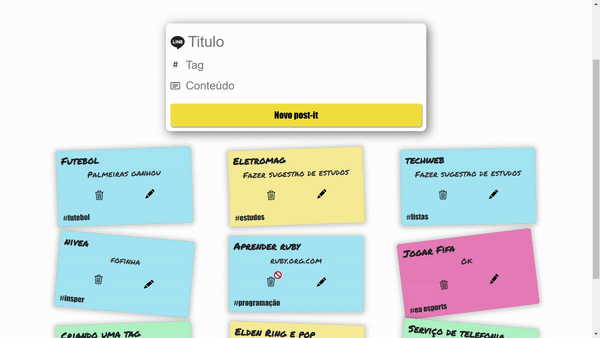

# Get-it 2.0
### Projeto de Tecnologias Web 1B

#### Aplicação disponível em: https://infinite-savannah-82282.herokuapp.com/

- Autor: Matheus Silva Melo de Oliveira

 <center></center>

Aplicação simples implementada com Django, Js, Postgree e Heroku.

Para executar (aplicação está disponível em deploy), execute sequencialmente:
```bash
git clone https://github.com/insper-tecnologias-web/projeto-1b-matheus-1618

python3 -m venv env

cd env/Scripts 

activate 

cd ../..

pip install -r requirements.txt


python manage.py runserver
```

### Professora: Bárbara Tieko

 ©Insper, 4° Semestre Engenharia da Computação, Tecnologias Web.
